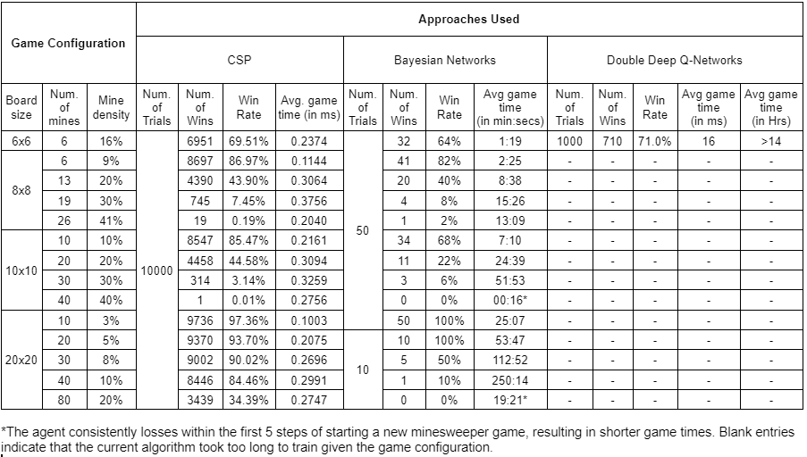

# CS4246 Project SEM 1 AY20/21

This project explores the implementation of MineSweeper Solver using various approaches, such as the CSP, Bayesian Network, and Double Deep Q-Network.

## Work Distribution

- CSP - Choon Siong
- DDQN - karthigeyan & Shawn
- Bayesian Networks - Shawn

## Our Experimental Results

---

## CSP
Adapted from http://www.cs.utoronto.ca/~cvs/minesweeper/

#### Requirements for CSP solver
    Java

#### How to Run CSP solver
1. Set up the configuration (eg. number of mines, number of rows/columns etc) to test in `src/map/PGMS.java`
2. Compile the code and run `PGMS`

---

## Bayesian Network (BN)
Adapted from https://github.com/mruwzum/MinesweeperBN

#### Requirements for BN solver
    pgmpy
    numpy
    pygame
    tqdm
    itertools

#### How to Run BN Solver
1. Configure the list of game configurations to test, as a list of tuples indicating (Board Width, Board Width, Number of Mines), in `BN/runTest.py` 
1. Run `python3 runTest.py` 

---

## DDQN Approach
Adapted from  https://github.com/Manjunatha-b/MineSweeperAI

#### Requirements for DDQN solver
    pytorch
    numpy
    matplotlib
    pygame

#### How to Run DDQN Solver
1. Make sure that theres an empty folder "pretrained" in DQN folder or else it will be overwritten if training from scratch
1. Make sure to have an empty log txt or rename any saved log to prevent in from being overwritten under Logs file
1. ***_cpu.py uses cpu only while the other attempts to use both gpu and cpu 
1. Edit line 193 of train_ddqn.py or train_ddqn_cpu.py for grid size and mines
1. Batches are saved every 200 epoch
1. Comment line 68 in train_ddqn.py or train_ddqn_cpu.py if training from scratch
1. To resume training, uncomment line 68 and input the epoch to train from. (check under pre-trained for last saved. )
`python3.9 train_ddqn_cpu.py`
